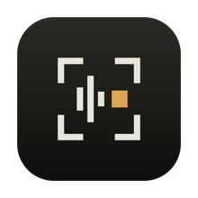

<div align="center">



# Screen2Prompt

**Narrate your screen. Get a prompt.**

Hit a key, talk while you work, hit another key whenever a screen matters.
Stop, and the whole session is on your clipboard — ready to paste into any chat.

macOS 26+ · menu bar only · no account · transcription runs on your Mac

</div>

---

## What it does

You are about to explain something to an AI — a bug, a broken layout, a weird API
response. Normally you screenshot, paste, type a paragraph, screenshot again, lose
track of which picture went with which sentence.

Screen2Prompt removes all of that. You talk while you work and press one key each time
a screen matters. When you stop, you get **one image per step** — the screenshot with
what you said about it printed underneath — already on your clipboard.

One `⌘V`. Every screen, every word, in order.

## Install

1. Download `Screen2Prompt.zip` from [Releases](../../releases), unzip, drag to `/Applications`.
2. The app is ad-hoc signed, so macOS quarantines it on first open. Clear that once:

   ```bash
   xattr -dr com.apple.quarantine /Applications/Screen2Prompt.app
   ```

3. Open it. Grant **Microphone** and **Screen Recording** when asked, then relaunch —
   macOS only applies a Screen Recording grant at launch.

That's it. No account, no API key, nothing to configure.

## Use it

| Key | Does |
|---|---|
| **⌥ R** | Start / stop recording |
| **⌥ C** | Capture the screen |

```
⌥R  →  talk while you work
⌥C  →  every time a screen matters (as many as you like)
⌥R  →  stop
⌘V  →  paste into any chat
```

Everything is also written to `~/Screen2Prompt/<timestamp>_<title>/`:

```
step-01.jpg      the card you pasted — screenshot + narration
doc.md           markdown, images by relative path
PROMPT.md        single self-contained file, images inlined
session.json     every word with its timestamp and confidence
images/          full-resolution screenshots
audio/           the 16 kHz session WAV
```

## Transcription

**Default: Apple's on-device `SpeechAnalyzer`.** Nothing leaves your Mac, there is no
API key, no rate limit and no file-size cap. Measured on an M-series Mac: **30–60×
realtime**, with per-word timestamps and per-word confidence. Digital silence returns
nothing at all, so it does not invent narration over quiet audio.

Two alternatives ship behind the same interface. Edit `~/.screen2prompt/config.json`:

```jsonc
{
  "provider": "apple",        // apple | groq | whisper
  "locale": "en-US",
  "groqModel": "whisper-large-v3-turbo",
  "whisperBinary": "/opt/homebrew/bin/whisper-cli",
  "whisperModel": "/path/to/ggml-base.en.bin",
  "tailSeconds": 5
}
```

**Groq** — for languages Apple has no on-device model for. Apple ships 30 locales and
**Hindi is not among them**, so code-switched Hinglish narration is the main reason to
reach for this. Store the key in your login keychain:

```bash
/Applications/Screen2Prompt.app/Contents/MacOS/Screen2Prompt --set-groq-key
```

The key is never written to `config.json` and never logged. `GROQ_API_KEY` in the
environment takes precedence if you would rather not use the keychain.

**whisper.cpp** — fully offline, no caps, works on a plane. Point `whisperBinary` and
`whisperModel` at a [whisper.cpp](https://github.com/ggerganov/whisper.cpp) build.

> The Groq and whisper.cpp paths are implemented but **not tested end to end**. The
> Apple path is what has been exercised. Expect to shake bugs out of the other two.

## How it works

The expensive part of understanding a screen recording is normally segmentation —
deciding which frames matter and which words belong to which frame. **The keypress
deletes that problem.** You are telling the tool, with your own hands, exactly which
screen matters and exactly when, so there is no inference to do. No OCR, no frame
diffing, no scene detection, no vision model.

Audio is written continuously as raw 16 kHz mono PCM, where byte offsets *are*
timestamps (`bytesPerSecond = 32000`). At stop, the whole session is transcribed in one
pass and words are assigned to steps by timestamp — step *i* owns audio from the end of
step *i−1* through `min(markerᵢ + tail, markerᵢ₊₁)`. The 5-second tail exists because
people click and *then* explain.

Because transcription runs at 30–60× realtime, transcribing once at the end is both
simpler and more accurate than chunking during recording — the model sees continuous
audio instead of fragments cut mid-sentence.

## Why cards instead of text plus attachments

A clipboard paste hands the receiving app **one** kind of content, and the app chooses.
Chat boxes take text or images, never both. And several images only arrive as several
attachments when they are carried as files; as raw image data they collapse into one.

So the narration is drawn *into* each card. Nothing depends on the text surviving, and
nothing depends on attachment order — every image states its own step number and
carries its own words.

## Build from source

Needs macOS 26 and the Xcode Command Line Tools. No full Xcode, no CocoaPods, no ffmpeg.

```bash
git clone https://github.com/coder360-crypto/Screen2Prompt.git
cd Screen2Prompt/app
./build.sh
open Screen2Prompt.app
```

## Known limitations

- **macOS 26+.** `SpeechAnalyzer` is the whole reason this needs no API key.
- **No Hindi on-device.** Apple's `supportedLocales` has 30 entries and none are `hi-*`.
  Use the Groq provider for code-switched narration.
- **Ad-hoc signed.** Every rebuild changes the app's identity, so macOS may ask for
  Screen Recording again after you update it.
- **The auto-title is naive** — it takes your first sentence. Rename the folder.
- **Narration inside a card is not selectable text.** Models read it fine; `doc.md` has
  the copyable version.
- **It records your microphone, not system audio.** Anything audible near your Mac —
  a video playing, someone talking — lands in the transcript.

## Licence

MIT. See [LICENSE](LICENSE).
